# MOCHA: Model-based single cell Open CHromatin Analysis

  <!-- badges: start -->
  [](https://github.com/aifimmunology/MOCHA/actions/workflows/R-CMD-check.yaml)
  <!-- badges: end -->

------------------------------------------------------------------------

## Table of Contents

-   [Introduction](#introduction)
-   [Installation](#library)
-   [Usage: Package Vignette on COVID PASC dataset](#vignette)
-   [Tips: Result formats](#results)
-   [Contact](#contact)
-   [License](#license)

------------------------------------------------------------------------

# <a name="introduction"></a> Introduction

MOCHA is an R package containing a novel single-cell peak-calling algorithm that leverages single-cell information to determine whether a particular genomic region is open by calculating two measures of intensities, and using these to call peaks via a hierarchical model.

# <a name="library"></a> Install package and load library

To install in a HISE IDE, run the following lines of code to install directly from GitHub replacing 'your_token' with your [Github Personal Access Token](https://docs.github.com/en/enterprise-server@3.4/authentication/keeping-your-account-and-data-secure/creating-a-personal-access-token).

    Sys.setenv(GITHUB_PAT='your_token') 
    devtools::install_github("aifimmunology/MOCHA")

# <a name="vignette"></a> Usage

Please view the example usage found in this [vignette](vignettes/COVID_example.R).

Example usage demonstrates this workflow: 



# <a name="results"></a> Tips: Result formats

While the pipeline can be run function-to-function, you may wish to inspect intermediate results or use end results for your own custom analyses. All MOCHA outputs use common Bioconductor data structures. We also provide some getters for accessing specific results.

## callOpenTiles results

The output of the first step of the pipeline, `MOCHA::callOpenTiles` is a [MultiAssayExperiment](https://www.bioconductor.org/packages/devel/bioc/vignettes/MultiAssayExperiment/inst/doc/MultiAssayExperiment.html#overview-of-the-multiassayexperiment-class) organizing your open-tiles by cell population. This is the input to the next function, `MOCHA::getSampleTileMatrices`.

``` r
> tileResults
A MultiAssayExperiment object of 3 listed
 experiments with user-defined names and respective classes.
 Containing an ExperimentList class object of length 3:
 [1] MAIT: RaggedExperiment with 2741985 rows and 6 columns
 [2] CD16 Mono: RaggedExperiment with 2204602 rows and 6 columns
 [3] DC: RaggedExperiment with 1439585 rows and 6 columns
Functionality:
 experiments() - obtain the ExperimentList instance
 colData() - the primary/phenotype DataFrame
 sampleMap() - the sample coordination DataFrame
 `$`, `[`, `[[` - extract colData columns, subset, or experiment
 *Format() - convert into a long or wide DataFrame
 assays() - convert ExperimentList to a SimpleList of matrices
 exportClass() - save data to flat files
```

Sample-level metadata can be accessed using `colData(tileResults)`.

A specific cell population's results are stored as a [RaggedExperiment](https://bioconductor.org/packages/release/bioc/vignettes/RaggedExperiment/inst/doc/RaggedExperiment.html).

This object stores ranged data alongside the sample-level metadata.

``` r
# Get open tiles for DC cells
> DCcellRaggedExp <- tileResults[["DC"]]
> DCcellRaggedExp
class: RaggedExperiment 
dim: 1439585 6 
assays(7): tileID TotalIntensity ... PredictionStrength peak
rownames: NULL
colnames(6): B011-AP0C1W3 B011-AP0C1W8 ... B025_FSQAAZ0C00P-07
  B025_FSQAAZ0BZZS-01
colData names(0):

# You can access the underlying GRanges object containing ranges for all samples
> rowRanges(DCcellRaggedExp)
GRanges object with 1439585 ranges and 0 metadata columns:
            seqnames              ranges strand
               <Rle>           <IRanges>  <Rle>
        [1]     chr1       812500-812999      *
        [2]     chr1       816000-816499      *
        [3]     chr1       817000-817499      *
        [4]     chr1       819000-819499      *
        [5]     chr1       819500-819999      *
        ...      ...                 ...    ...
  [1439581]     chrX 155841500-155841999      *
  [1439582]     chrX 155881000-155881499      *
  [1439583]     chrX 155888000-155888499      *
  [1439584]     chrX 155891500-155891999      *
  [1439585]     chrX 155964000-155964499      *
  -------
  seqinfo: 24 sequences from an unspecified genome; no seqlengths
```

## getSampleTileMatrix results

The output of getSampleTileMatrix is a [SummarizedExperiment](https://bioconductor.org/packages/devel/bioc/vignettes/SummarizedExperiment/inst/doc/SummarizedExperiment.html) organizing the sample-tile matrices by cell population. This is the input to `MOCHA::getDifferentialAccessibleTiles` and other downstream analyses.

``` r
> SampleTileMatrices
class: RangedSummarizedExperiment 
dim: 212445 6 
metadata(6): Log2Intensity NAtoZero ... Org Directory
assays(3): MAIT CD16 Mono DC
rownames(212445): chr1:1000000-1000499 chr1:100028500-100028999 ...
  chrY:7730500-7730999 chrY:7940000-7940499
rowData names(3): MAIT CD16 Mono DC
colnames(6): B011-AP0C1W3 B011-AP0C1W8 ... B025_FSQAAZ0C00P-07
  B025_FSQAAZ0C0YJ-01
colData names(178): Sample PassQC ... ATAC_WellID AIFI.Batch
```

It also holds metadata related to the genome, transcript database, and annotations: `metadata(SampleTileMatrices)`

Individual sample-tile matrices for each cell population can be accessed as follows. These are filtered to only return tiles called for the given cell population.

``` r
# Get the sample-tile matrix for DC cells
DCcellsMatrix <- MOCHA::getCellPopMatrix(SampleTileMatrices, "DC")
# Get the sample-tile matrix for MAIT cells
MAITcellsMatrix <- MOCHA::getCellPopMatrix(SampleTileMatrices, "MAIT")
```

## getDifferentialAccessibleTiles results

Results of `MOCHA::getDifferentialAccessibleTiles` is given as a `data.table` and can be filtered using data.table syntax:

``` r
> differentials[FDR<0.4]
                          Tile CellPopulation Foreground Background   P_value
   1:     chr1:1000000-1000499           MAIT   Positive   Negative 0.0808556
   2: chr1:100038500-100038999           MAIT   Positive   Negative 0.0808556
   3:   chr1:10032500-10032999           MAIT   Positive   Negative 0.0808556
   4: chr1:100424000-100424499           MAIT   Positive   Negative 0.0808556
   5: chr1:100927500-100927999           MAIT   Positive   Negative 0.0808556
  ---                                                                        
8048:   chrX:77899000-77899499           MAIT   Positive   Negative 0.0808556
8049:   chrX:77910500-77910999           MAIT   Positive   Negative 0.0808556
8050:   chrX:78104000-78104499           MAIT   Positive   Negative 0.0808556
8051:   chrX:78945000-78945499           MAIT   Positive   Negative 0.0808556
8052:     chrX:9464500-9464999           MAIT   Positive   Negative 0.0808556
      Test-Statistic       FDR    Log2FC_C   MeanDiff Avg_Intensity_Case
   1:       3.047619 0.3457015  0.01558005  0.2991209           3.803282
   2:       3.047619 0.3457015 -0.03178178 -0.2803330           3.948745
   3:       3.047619 0.3457015  0.02554094  0.3312654           4.103977
   4:       3.047619 0.3457015 -0.17011403 -1.6639420           3.500481
   5:       3.047619 0.3457015 -0.08410144 -0.6814757           3.689488
  ---                                                                   
8048:       3.047619 0.3457015  0.02367545  0.2179824           3.916536
8049:       3.047619 0.3457015  0.02077454  0.2111809           4.019993
8050:       3.047619 0.3457015  0.01051873  0.1599092           4.039884
8051:       3.047619 0.3457015 -0.12853838 -1.2824704           3.670366
8052:       3.047619 0.3457015 -0.08677006 -0.7969690           3.660102
      Pct0_Case Avg_Intensity_Control Pct0_Control
   1:         0              3.787702            0
   2:         0              3.956360            0
   3:         0              4.079114            0
   4:         0              3.746133            0
   5:         0              3.746400            0
  ---                                             
8048:         0              3.907190            0
8049:         0              3.999219            0
8050:         0              4.032155            0
8051:         0              3.798904            0
8052:         0              3.755235            0
```

*Note that these statistics are poor due to the small \# of samples in the example vignette.*

## getCoAccessibleLinks results

Results of `MOCHA::getCoAccessibleLinks` is given as a `data.frame` and can be filtered further according to correlation using `MOCHA::filterCoAccessibleLinks`.

``` r
> links
     Correlation                Tile1                Tile2
  1:   0.5481481 chrY:7326500-7326999 chrY:6964500-6964999
  2:   0.5481481 chrY:7326500-7326999 chrY:6965000-6965499
  3:   0.6666667 chrY:7326500-7326999 chrY:7040500-7040999
  4:   0.7259259 chrY:7326500-7326999 chrY:7085000-7085499
  5:   0.8444444 chrY:7326500-7326999 chrY:7085500-7085999
 ---                                                      
126:   0.4166667 chrY:7344500-7344999 chrY:7300000-7300499
127:   0.6666667 chrY:7344500-7344999 chrY:7310500-7310999
128:   0.6666667 chrY:7344500-7344999 chrY:7311000-7311499
129:   0.6666667 chrY:7344500-7344999 chrY:7326000-7326499
130:   0.3333333 chrY:7344500-7344999 chrY:7340000-7340499


> MOCHA::filterCoAccessibleLinks(links, threshold = 0.7)
    Correlation                Tile1                Tile2  chr   start     end
 1:   0.7259259 chrY:7326500-7326999 chrY:7085000-7085499 chrY 7085000 7326999
 2:   0.8444444 chrY:7326500-7326999 chrY:7085500-7085999 chrY 7085500 7326999
 3:   0.7851852 chrY:7326500-7326999 chrY:7099500-7099999 chrY 7099500 7326999
 4:   0.7259259 chrY:7326500-7326999 chrY:7279500-7279999 chrY 7279500 7326999
 5:   0.9037037 chrY:7326500-7326999 chrY:7280000-7280499 chrY 7280000 7326999
```

# <a name="contact"></a> Contact

To contact the developers on issues and feature requests, please contact us via the discussions tab for feature requests, or open issues for any bugs.

# <a name="license"></a> License

MOCHA follows the Allen Institute Software License - full information about the license can be found on the LICENSE file.
