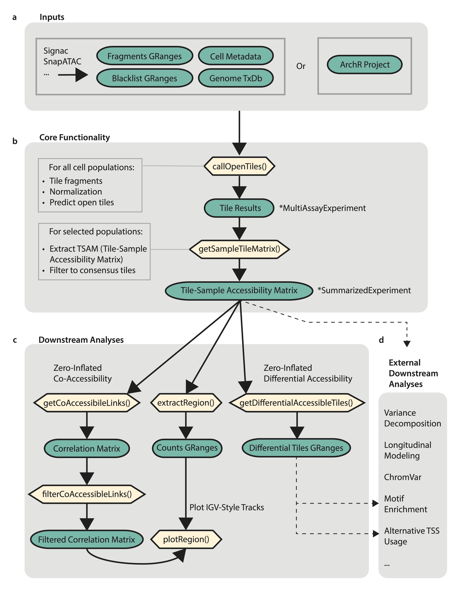

# MOCHA: Model-based single-cell Open Chromatin Analysis

MOCHA is an R package meant to enable robust sample-specific scATAC analysis by providing a novel single-cell peak-calling algorithm and leveraging the latest in zero-inflated statistical methods. We hope this package will enable translational research on scATAC datasets by addressing statistical issues around peak calling, differential accessibility, co-accessibility, and repeated measures. Our goal is to enable intuitive and robust identification of open chromatin, differential accessibility, and co-accessibility so that biomedical researchers can leverage scATAC datasets to identify the therapeutic targets. 

Find out more by visiting the [MOCHA website](https://aifimmunology.github.io/MOCHA/).

------------------------------------------------------------------------

### Table of Contents

-   [Installation](#installation)
-   [Overview](#overview)
-   [Contact](#contact)

-----------------------------------------------------------------------

##  Installation
Install from binaries (stable release on CRAN):
  
    install.packages("MOCHA")
    
Install from source:

    devtools::install_github("aifimmunology/MOCHA")

Install a specific development branch from source:

    devtools::install_github("aifimmunology/MOCHA", ref = "your_branch_name")

##  Usage Overview

Please view the example usage found in the vignette found under
`vignettes/COVID-walkthrough.html`.

The example usage demonstrates this workflow: 

##  Contact

To contact the developers on issues and feature requests, please contact us via GitHub's discussions tab for feature requests, or open issues for any bugs.
