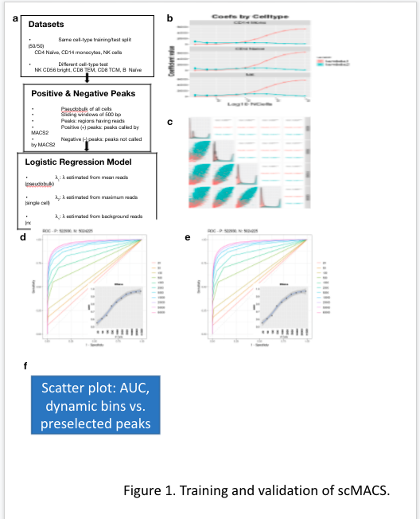

README for scMACS
===============

* * *

Table of Contents
-----------------

* [Introduction](#introduction)
* [Install package and load library](#library)
* [Package Vignette on COVID PASC dataset](#vignette)
* [Tutorials](#example-main)
    * [Tutorial-1: Peak-calling on Entire Cell Populations](#example1)
    * [Tutorial-2: Sample-specific Peak-calling](#example2)
    * [Tutorial-3: Differential Accessibility](#example3)
    * [Tutorial-4: Sample X Peak Matrix](#example4)

* [Contact](#contact)
* [License](#license)

* * *

#  Introduction
scMACS is an R package containing a novel single-cell peak-calling algorithm that leverages single-cell information to determine whether a particular genomic region is open by calculating two measures of intensities, and using these to call peaks via a hierarchical model. 

    
scATAC processing and overview of the **scMACS** algorithm. 

#  Install package and load library

To install library, run the following lines of code to install directly from GitHub

    devtools::install_github("aifimmunology/scMACS", ref="package-details")
    library("scMACS")

#  Usage
Example usage can be found in this [vignette](vignettes/COVID_example.R).

#  Contact

To contact the developers on issues and feature requests, please contact us via the discussions tab for feature requests, or open issues for any bugs. 
    
#  License

scMACS follows the Allen Institute Software License - full information about the license can be found on the LICENSE file. 
