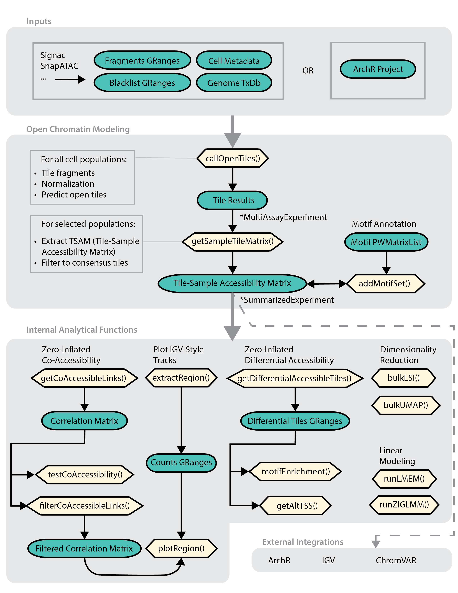

# MOCHA: Model-based single cell Open CHromatin Analysis
------------------------------------------------------------------------

## Table of Contents

-   [Introduction](#introduction)
-   [Installation](#library)
-   [Usage: Package Vignette on COVID PASC dataset](#vignette)
-   [Tips: Result formats](#results)
-   [Contact](#contact)
-   [License](#license)

------------------------------------------------------------------------

# <a name="introduction"></a> Introduction

MOCHA is an R package containing a novel single-cell peak-calling algorithm that leverages single-cell information to determine whether a particular genomic region is open by calculating two measures of intensities, and using these to call peaks via a hierarchical model.

# <a name="library"></a> Install package and load library
install.packages('MOCHA') 

# <a name="vignette"></a> Usage

Please view the example usage found in the vignette found under
`vignettes/COVID-walkthrough.html`.

The example usage demonstrates this workflow: 



# <a name="results"></a> Tips: Result formats

While the pipeline can be run function-to-function, you may wish to inspect intermediate results or use end results for your own custom analyses. All MOCHA outputs use common Bioconductor data structures. We also provide some getters for accessing specific results.

## callOpenTiles results

The output of the first step of the pipeline, `MOCHA::callOpenTiles` is a [MultiAssayExperiment](https://www.bioconductor.org/packages/devel/bioc/vignettes/MultiAssayExperiment/inst/doc/MultiAssayExperiment.html#overview-of-the-multiassayexperiment-class) organizing your open-tiles by cell population. This is the input to the next function, `MOCHA::getSampleTileMatrices`.

Sample-level metadata can be accessed using `colData(tileResults)`.

A specific cell population's results are stored as a [RaggedExperiment](https://bioconductor.org/packages/release/bioc/vignettes/RaggedExperiment/inst/doc/RaggedExperiment.html).

This object stores ranged data alongside the sample-level metadata.


## getSampleTileMatrix results

The output of getSampleTileMatrix is a [SummarizedExperiment](https://bioconductor.org/packages/devel/bioc/vignettes/SummarizedExperiment/inst/doc/SummarizedExperiment.html) organizing the TSAM (Tile Sample Accessibility Matrix) by cell population. This is the input to `MOCHA::getDifferentialAccessibleTiles` and other downstream analyses.

``` r

## Subset results for Chr 4
> SampleTileMatrices[grep('chr4', rownames(SampleTileMatrices)),]
class: RangedSummarizedExperiment 
dim: 8112 39 
metadata(6): CellCounts FragmentCounts ... OrgDb Directory
assays(1): CD16 Mono
rownames(8112): chr4:10005500-10005999 chr4:10006000-10006499 ...
  chr4:99961000-99961499 chr4:99961500-99961999
rowData names(1): CD16 Mono
colnames(39): B011-AP0C1W3 B011-AP0C1W8 ... FSQEAZ0C2D3-02
  FSQFAZ0BZJQ-02
colData names(186): Sample well_id ... ATAC_WellID AIFI.Batch


```

It also holds metadata related to the genome, transcript database, and annotations: `metadata(SampleTileMatrices)`

## getDifferentialAccessibleTiles results

Results of `MOCHA::getDifferentialAccessibleTiles` is given either as a `data.table` or a 'granges' and can be filtered accordingly:

``` r
> head(plyranges::filter(differentials, seqnames =='chr4' & FDR < 0.2))
GRanges object with 6 ranges and 13 metadata columns:
      seqnames              ranges strand |                   Tile
         <Rle>           <IRanges>  <Rle> |            <character>
  [1]     chr4   10023500-10023999      * | chr4:10023500-10023999
  [2]     chr4   10024000-10024499      * | chr4:10024000-10024499
  [3]     chr4   10063500-10063999      * | chr4:10063500-10063999
  [4]     chr4   10096500-10096999      * | chr4:10096500-10096999
  [5]     chr4     1010500-1010999      * |   chr4:1010500-1010999
  [6]     chr4 101346000-101346499      * | chr4:101346000-10134..
      CellPopulation  Foreground  Background     P_value Test_Statistic
         <character> <character> <character>   <numeric>      <numeric>
  [1]      CD16 Mono    Positive    Negative 0.002610899       11.89612
  [2]      CD16 Mono    Positive    Negative 0.023560228        7.49639
  [3]      CD16 Mono    Positive    Negative 0.000421733       12.43336
  [4]      CD16 Mono    Positive    Negative 0.006561717       10.05301
  [5]      CD16 Mono    Positive    Negative 0.016701496        5.72747
  [6]      CD16 Mono    Positive    Negative 0.006274534        7.46972
            FDR  Log2FC_C   MeanDiff Avg_Intensity_Case Pct0_Case
      <numeric> <numeric>  <numeric>          <numeric> <numeric>
  [1] 0.0788621  1.023296  2.9715709            12.3478 0.0000000
  [2] 0.1910923  0.648633 -0.0879542            12.2027 0.0588235
  [3] 0.0451423  0.786501  0.7773734            12.8422 0.0000000
  [4] 0.1124369  0.739042  1.3575321            13.0183 0.0000000
  [5] 0.1628641 -0.476150 -0.4293368            13.6077 0.0000000
  [6] 0.1091473 -0.397274 -0.3913687            13.1689 0.0000000
      Avg_Intensity_Control Pct0_Control
                  <numeric>    <numeric>
  [1]               11.1988    0.1818182
  [2]               11.4155    0.0000000
  [3]               12.0881    0.0000000
  [4]               12.2886    0.0454545
  [5]               14.2039    0.0000000
  [6]               13.5651    0.0000000
  -------
  seqinfo: 24 sequences from an unspecified genome; no seqlengths
```

## getCoAccessibleLinks results

Results of `MOCHA::getCoAccessibleLinks` is given as a `data.frame` and can be filtered further according to correlation using `MOCHA::filterCoAccessibleLinks`.

``` r
> head(links)
   Correlation                  Tile1                  Tile2
1:  0.06203363 chr4:10023500-10023999 chr4:10005500-10005999
2: -0.07812306 chr4:10023500-10023999 chr4:10006000-10006499
3:  0.06192133 chr4:10023500-10023999 chr4:10006500-10006999
4:  0.25329153 chr4:10023500-10023999 chr4:10007000-10007499
5:  0.09938466 chr4:10023500-10023999 chr4:10013500-10013999
6:  0.03643015 chr4:10023500-10023999 chr4:10015000-10015499


> MOCHA::filterCoAccessibleLinks(links, threshold = 0.4)
   Correlation                  Tile1                  Tile2  chr    start      end
1:   0.5035455 chr4:10023500-10023999 chr4:10024000-10024499 chr4 10023500 10024499
2:   0.5121115 chr4:10023500-10023999 chr4:10063500-10063999 chr4 10023500 10063999
3:   0.4059254 chr4:10023500-10023999 chr4:10078000-10078499 chr4 10023500 10078499
4:   0.4003500 chr4:10023500-10023999 chr4:10096500-10096999 chr4 10023500 10096999
5:   0.4367843 chr4:10023500-10023999 chr4:10106500-10106999 chr4 10023500 10106999
```

# <a name="contact"></a> Contact

To contact the developers on issues and feature requests, please contact us via the discussions tab for feature requests, or open issues for any bugs.

# <a name="license"></a> License

MOCHA follows the Allen Institute Software License - full information about the license can be found on the LICENSE file.
