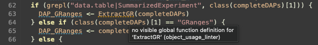
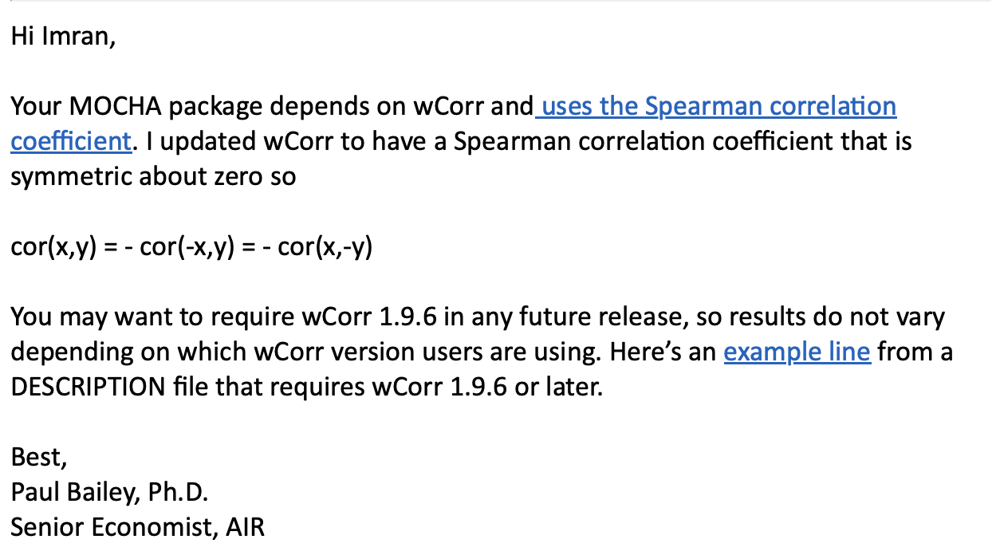

```{r, include = FALSE}
knitr::opts_chunk$set(
  collapse = TRUE,
  comment = "#>",
  eval = FALSE
)
```
```{r, include=FALSE}
options(width = 60)
local({
  hook_output <- knitr::knit_hooks$get('output')
  knitr::knit_hooks$set(output = function(x, options) {
    if (!is.null(options$max.height)) options$attr.output <- c(
      options$attr.output,
      sprintf('style="max-height: %s;"', options$max.height)
    )
    hook_output(x, options)
  })
})
```
In-progress, updated 2/8/23

Here is an opinionated collection of "best practices" for developing an R package, written from the perspective of turning existing analysis code into a robust and scalable package for the community. Some some lessons were learned the easy way (reading guides) while others the hard way (through necessity). This will hopefully serve as a living document where adding to it can increase the number of practices that can be learned the easy way.


Though these were written about R development, the gist of most topics here can be applied to other languages.

Resources used:

- [Advanced R (Hadley)](https://adv-r.hadley.nz/)
- [R Packages (Hadley)](https://r-pkgs.org/)
- [Mastering Software Development in R](https://rdpeng.github.io/RProgDA/)

----------------------------------------------

# Style and Conventions

## Full-featured IDEs
- (RStudio, VSCode, heavily modded Vim) > (text editor in JupyterLab)

RStudio has some basic linting, debugging tools, autocomplete, spellcheck, and global search. 
RStudio also shows your environment, and has features to make writing ROxygen headers and RMarkdown documentation easier.

An IDE may also let you jump to function or object definitions, and easily locate where those functions and objects are references.

## Linters

A linter does "static code analysis" - see [lintr for R](https://github.com/r-lib/lintr#lintr).
This will greatly reduce the cognitive load when coding, help minimize mistakes, and help conform to style guidelines with minimal effort.

These can often be installed as extensions for your IDE.

If you use JupyterLab, You can add a lintr [and other features with jupyterlab-lsp](https://github.com/jupyter-lsp/jupyterlab-lsp#features) following these instructions:

1. Install jupyterlab-lsp and language servers for Python and R. 
```
# Install jupyterlab-lsp
pip install 'jupyterlab>=3.0.0,<4.0.0a0' jupyterlab-lsp
# Install language servers for Python and R
pip install 'python-lsp-server[all]'
R -e 'install.packages("languageserver")'
```
2. Reboot JupyterLab 
3. If these features aren't enabled after a reboot, go to the `Settings tab -> Advanced Settings -> Language Server` and add these lines to your user preferences:
```
{
    "language_servers": {
    "pylsp": {
      "serverSettings": {
        "pyls.plugins.pydocstyle.enabled": true,
        "pyls.plugins.pyflakes.enabled": false,
        "pyls.plugins.flake8.enabled": true
      }
    },
    "r-languageserver": {
      "serverSettings": {
        "r.lsp.debug": false,
        "r.lsp.diagnostics": true,
        "r.lsp.snippet_support": true
      }
    }
  }
}
```
{width=70%}

## Automatic code styling

Opinionated tools for making your code tidier and easier to read and share with others.
- (styler for R)[https://github.com/r-lib/styler#styler] follows the tidyverse style guide by default.
- (Black for Python)[https://github.com/psf/black#the-uncompromising-code-formatter] is more heavy-handed, but more important for a language like Python where tabs and spaces have meaning.


-------------------------------


# Maximizing use of GitHub
## Package repository vs storage repository
Usage of [MOCHA](https://github.com/aifimmunology/MOCHA) vs [MOCHA_Manuscript](https://github.com/aifimmunology/MOCHA_Manuscript)
## Branching for new features
## Pull Requests, Code Review, and Branch Protections
## Versioning

-------------------------------


# Preparing for CRAN
## devtools::check() yourself (frequently)

Frequently running `devtools::check()` will catch any missing documentation or structural issues.
If you have unit tests it will also run these.

It will also catch namespace issues, though these are preferrably caught by a linter.


## CRAN preferences

CRAN has some non-obvious opinions that it will enforce.

- No internal references to functions within the same packages. E.g. if you have an internal function `internalHelper()` in your package `MOCHA`, CRAN does not want you to access it via `MOCHA:::internalHelper()`. Instead, use it directly like `internalHelper()`.
- `message()` and other output functions like `warning()` and `error()` are enforced over using `print()`. [This useful StackOverFlow post](https://stackoverflow.com/questions/36699272/why-is-message-a-better-choice-than-print-in-r-for-writing-a-package) goes into the details of why `message()` is better and when to use each.
- All output must be suppressible. This means adding a `verbose` boolean argument to your functions and printing warnings and messages only when `verbose==TRUE`.

### NOTEs

Learned the hard way: Running `devtools::check()` the first time after writing code without the use of linters and automatic stylers resulted in hundreds of NOTES, one for each line where a violation was found. 

### Manual Inspection Notes


CRAN Manual inspection

- [x] Please always explain all acronyms in the description text. e.g.: ATAC

- [x] If there are references describing the methods in your package, please
add these in the description field of your DESCRIPTION file in the form
authors (year) <doi:...>
authors (year) <arXiv:...>
authors (year, ISBN:...)
or if those are not available: <https:...>
with no space after 'doi:', 'arXiv:', 'https:' and angle brackets for
auto-linking.
(If you want to add a title as well please put it in quotes: "Title")

- [x] Size of tarball: 5889964 bytes
-> Please not more than 5MB for CRAN packages


- [x] Please add \value to .Rd files regarding exported methods and explain
the functions results in the documentation. Please write about the
structure of the output (class) and also what the output means. (If a
function does not return a value, please document that too, e.g.
\value{No return value, called for side effects} or similar)
Missing Rd-tags:
      GRangesToString.Rd: \value
      StringsToGRanges.Rd: \value

- [x] "Using foo:::f instead of foo::f allows access to unexported objects.
This is generally not recommended, as the semantics of unexported
objects may be changed by the package author in routine maintenance."
Please omit one colon.
Used ::: in documentation:
      man/callOpenTiles-methods.Rd:
         tiles <- MOCHA::callOpenTiles(ATACFragments =
MOCHA:::ATACFragments, cellColData = MOCHA:::cellColData, blackList =
MOCHA:::blackList, genome = MOCHA:::genome, TxDb = TxDb, Org = Org,
outDir = "./test_out", cellPopLabel = "Clusters", cellPopulations =
c("C1", "C2"), numCores = 1)

- [x] \dontrun{} should only be used if the example really cannot be executed
(e.g. because of missing additional software, missing API keys, ...) by
the user. That's why wrapping examples in \dontrun{} adds the comment
("# Not run:") as a warning for the user.
Does not seem necessary.
Please unwrap the examples if they are executable in < 5 sec, or create
additionally small toy examples to allow automatic testing.
(You could also replace \dontrun{} with \donttest, if it takes longer
than 5 sec to be executed, but it would be preferable to have automatic
checks for functions. Otherwise, you can also write some tests.)

- [x] You write information messages to the console that cannot be easily
suppressed. It is more R like to generate objects that can be used to
extract the information a user is interested in, and then print() that
object.
Instead of print()/cat() rather use message()/warning()  or
if(verbose)cat(..) (or maybe stop()) if you really have to write text to
the console.
(except for print, summary, interactive functions)

- [x] Please ensure that your functions do not write by default or in your
examples/vignettes/tests in the user's home filespace (including the
package directory and getwd()). This is not allowed by CRAN policies.
Please omit any default path in writing functions. In your
examples/vignettes/tests you can write to tempdir().


## Minimize dependencies
### Dependencies that cause issues
wCorr was just updated and we received this correspondance:
{width=60%}


Previously, we depended on motifmatchr, which depends on TFBSTools which depends finally on CNEr which had an incorrectly declared license causing MOCHA to fail CRAN's pretest:
```
> Thanks, we see:
>
>     Package has a FOSS license but eventually depends on the following
>     package which restricts use:
>       CNEr
>
> and so I looked at the license.
> It has a wrongly used "| file LICENSE" as that LICENSE suggests that the
> GPL-2 declaration is invalid as it cannot be FOSS. I made a case for
> this at BioC.
```
A week after emailing the CNEr package maintainer and raising an issue on GitHub, we decided to just omit the dependency by making it optional (moving it to _Suggests_ in the `DESCRIPTION`) and using it conditionally.
```
> I see MOCHA is still in the “waiting” folder of CRAN incoming. Are we
> waiting for the maintainers of CNEr to update their license in

Yes, otherwise you need to omit a dependency on a package with an
invalid license.


> Bioconductor? Let me know if I can take any action to help this move
> forward.

Give its maintainer a strong hint?
```

### Dependencies outside of standard repositories

ArchR is not in standard repositories, so even though we move it to _Suggests_ CRAN still has to locate it in an outside repository - GitHub does not count. 
We followed instructions using the pacakge [drat](https://eddelbuettel.github.io/drat/vignettes/dratstepbystep/) to create [a repository containing the package binaries for ArchR](https://github.com/imran-aifi/drat) and update our [DESCRIPTION](https://github.com/aifimmunology/MOCHA/blob/4d5013d066021fbedad515e262627b9f6127d780/DESCRIPTION#L91) to point to it under _Additional_repositories_.


-------------------------------


# Testing
## Unit Tests
 - [testthat](https://testthat.r-lib.org/)
 - https://github.com/aifimmunology/MOCHA/tree/main/tests/testthat
 
 
### Test Coverage
- [covr](https://covr.r-lib.org/)


## Continuous Integration
 - [GitHub Actions to run tests, CRAN checks)[https://github.com/aifimmunology/MOCHA/actions/workflows/R-CMD-check-manual.yml]
 
 
## Package Data
 - https://r-pkgs.org/data.html
 - https://github.com/aifimmunology/MOCHA/blob/main/data-raw/DATASET.R
 
 
-------------------------------


# Miscellaneous

## parLapply

## Being portable

Design issue of saving a BSGenome object which points to a specific location on a user's filesystem 


-------------------------------


# Debugging R
## Aligning environments and package managers
## Iterating quickly on code changes
## Breakpoints with browser()

-------------------------------

# Preparing for Users

## Writing Documentation

### Roxygen Headers

### Keywords

Keywords will allow you to more easily sort functions into groups for organizing documentation.
See:
- pkgdown https://pkgdown.r-lib.org/reference/build_reference.html#reference-index
- ArchR's reference page as example https://www.archrproject.com/reference/index.html


## Writing Error Messages

## Vignettes

## Contribution Guidelines

